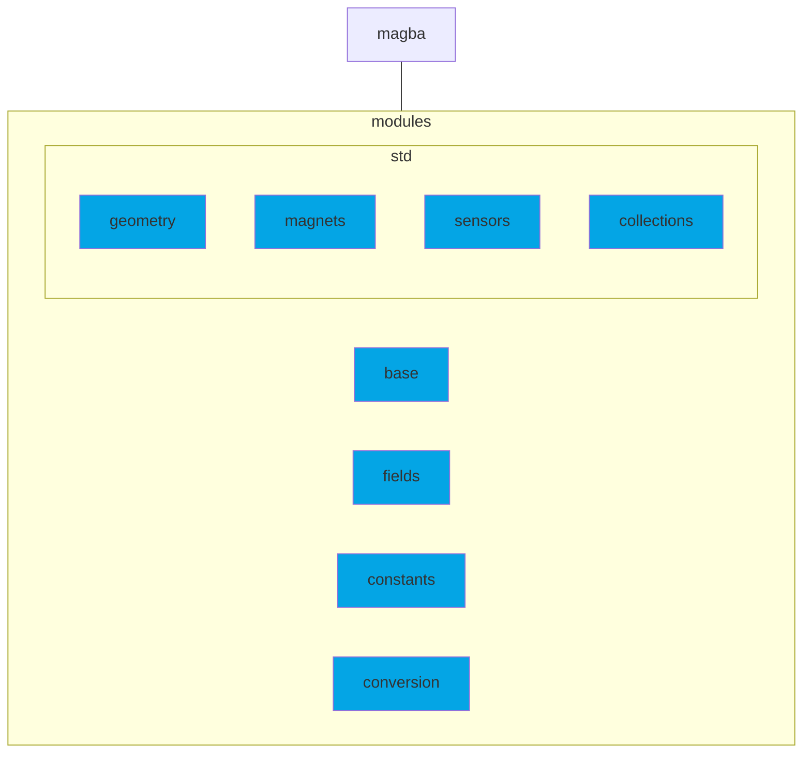

# Magba Architecture

```mermaid
flowchart TD
    classDef module fill:#04a5e5;

    magba

    magba --- modules

    subgraph modules
        base
        fields
        constants
        conversion
        subgraph std
            geometry
            magnets
            sensors
            collections
        end
    end    

    class base,fields,geometry,magnets,sensors,collections,conversion,constants module
```
