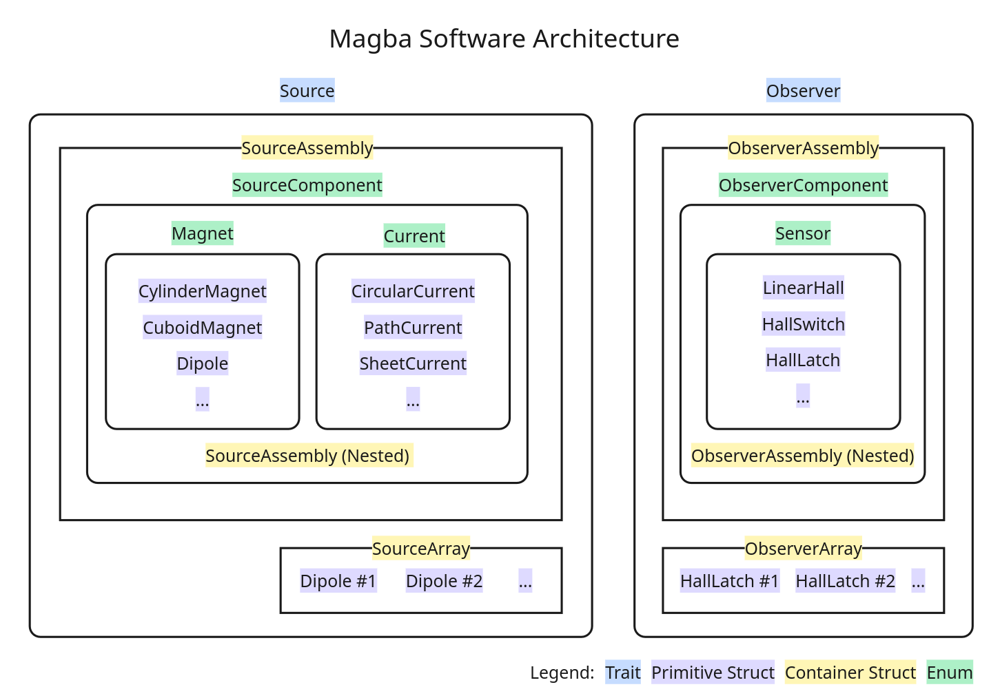

# Summary

Magba is an analytical magnetostatic computation library designed for high-performance and seamless integration into the Rust scientific computing ecosystem. Leveraging zero-cost abstractions, it provides highly parallelized routines for evaluating magnetic fields generated by permanent magnets and current loops. Magba allows researchers to construct and manipulate complex magnetic systems with low runtime overhead.

# Statement of Need

Accurate and fast computation of static magnetic fields is essential in numerous scientific and engineering domains, including sensor design [@jones2020], magnetic resonance imaging (MRI) [@koch2009], and robotics [@song2018]. While the finite element method (FEM) provides versatile solutions for complex geometries, it is computationally intensive and often unsuitable for real-time applications. Analytical solutions for canonical magnet geometries provide a substantially faster alternative, yet relatively few software packages implement them. The most notable instance is Magpylib [@ortner2020], a Python library for analytical field computation. However, its reliance on the Python interpreter can bottleneck performance-critical workloads, such as optimization algorithms in magnetic tracking systems.

Magba is a Rust library for high-performance magnetostatic field computation based on analytical solutions. It provides parallelized magnetic field calculation routines with low memory overhead while exposing a high-level, object-oriented API for constructing and manipulating magnetic systems. Additionally, the library provides physical sensor implementations, such as linear Hall effect sensors, that can be integrated into magnetic systems to measure magnetic fields and simulate readings.

# Software Implementation

Field functions are implemented based on fundamental expressions, such as the Biot-Savart law and the magnetic dipole equations [@furlani2001], as well as analytical solutions from the literature [@derby2010; @caciagli2018; @ortner2023]. The implementations utilize a custom generic float trait that provides magnetic constants and integrates with the mathematical backends. All physical quantities are assumed to be in SI units.



Magba represents physical entities using algebraic data types, expresses behavior through trait-based closed polymorphism, and organizes entities using a hierarchical composite model (Figure 1). This design avoids dynamic dispatch for built-in entity types while preserving extensibility through hierarchical composition. The concrete types implement core traits, such as `Source` (for objects that generate magnetic fields) and `Observer` (for objects that measure them). All objects implement the `Transform` trait, which defines the spatial manipulation behaviors and integrates with nalgebra, a widely adopted linear algebra library in Rust [@dimforge2026].

The composition system provides two types of containers: arrays and assemblies. The arrays (`SourceArray`, `ObserverArray`) are fixed-sized, stack-allocated collections of homogeneous entities, while the assemblies (`SourceAssembly`, `ObserverAssembly`) are dynamically sized, heap-allocated collections of heterogeneous types, that support nesting and custom types by wrapping them in the `SourceComponent` and `ObserverComponent` enums. Each child in the collection is stored as a node that, in addition to holding the concrete entity, keeps track of the pose offsets relative to its parent, maintaining accuracy after repeated transformation.

# Results

The library is extensively tested against Magpylib [@ortner2020]. The performance is evaluated against Magpylib's fully vectorized NumPy implementations. The magnetic polarization vector of the test magnets is standardized at $[1, 2, 3]$ Tesla. The observer points are evenly spaced from $-0.5$ m to $+0.5$ m, with 10 points along each axis, forming a grid of 1,000 points. Relative Euclidean distance error is used as the metric.

The following results were generated on an AMD Ryzen 5 4600H with Radeon Graphics @4.0 GHz, 16 GB of RAM, running x86_64-unknown-linux-gnu rustc 1.90.0 and magba v0.6.1. The performance is benchmarked using Criterion, and the compute times are divided by the number of test cases (1,000) to obtain the approximate time to compute the field function for an observer point.

Table 1: Summary of Field Function Accuracy and Performance at 64-bit Precision.

+--------------+-----------------------+-----------------------+-----------+--------------+--------------+
| **Function** | **Median Error**      | **Max Error**         | **Magba** | **Magpylib** | **Speedup**  |
+:=============+:======================+:======================+:==========+:=============+:=============+
| **Magnets**                                                                                            |
+--------------+-----------------------+-----------------------+-----------+--------------+--------------+
| Cylinder     | $2.947\times10^{-13}$ | $2.501\times10^{-10}$ | 62.4 ns   | 2.49 μs      | 40x          |
+--------------+-----------------------+-----------------------+-----------+--------------+--------------+
| Cuboid       | $0.000$               | $2.103\times10^{-13}$ | 133.0 ns  | 1.33 μs      | 10x          |
+--------------+-----------------------+-----------------------+-----------+--------------+--------------+
| Dipole       | $0.000$               | $0.000$               | 31.6 ns   | 422 ns       | 13x          |
+--------------+-----------------------+-----------------------+-----------+--------------+--------------+
| Sphere       | $0.000$               | $8.078\times10^{-16}$ | 26.6 ns   | 518 ns       | 19x          |
+--------------+-----------------------+-----------------------+-----------+--------------+--------------+
| Tetrahedron  | $0.000$               | $1.020\times10^{-10}$ | 109.1 ns  | 4.07 μs      | 37x          |
+--------------+-----------------------+-----------------------+-----------+--------------+--------------+
| Triangle     | $0.000$               | $2.405\times10^{-12}$ | 55.3 ns   | 881 ns       | 16x          |
+--------------+-----------------------+-----------------------+-----------+--------------+--------------+
| Mesh         | $0.000$               | $1.020\times10^{-10}$ | 109.7 ns  | 7.53 μs      | 69x          |
+--------------+-----------------------+-----------------------+-----------+--------------+--------------+
| **Currents**                                                                                           |
+--------------+-----------------------+-----------------------+-----------+--------------+--------------+
| Circular     | $0.000$               | $0.000$               | 46.7 ns   | 739 ns       | 16x          |
+--------------+-----------------------+-----------------------+-----------+--------------+--------------+
| Path         | $0.000$               | $0.000$               | 52.5 ns   | 1.87 μs      | 36x          |
+--------------+-----------------------+-----------------------+-----------+--------------+--------------+
| Sheet        | $0.000$               | $0.000$               | 197.3 ns  | 19.4 μs      | 98x          |
+--------------+-----------------------+-----------------------+-----------+--------------+--------------+
| Triangle     | $0.000$               | $0.000$               | 78.5 ns   | 10.6 μs      | 135x         |
+--------------+-----------------------+-----------------------+-----------+--------------+--------------+

The results closely align with Magpylib, with the median below one machine epsilon for most implementations. The slight variance observed in the cylinder magnet calculations is attributable to the different mathematical backends used to evaluate elliptic integrals, namely Ellip [@pornsiriprasert2026] versus SciPy [@virtanen2020].

# Usage Example

The following example demonstrates a magnetic field calculation generated by an assembly of cylindrical and cuboid magnets at a specific observer point.

```rust
use magba::{prelude::*, sources};

fn main() {
    // Create a cylindrical magnet with polarization (0, 0, 1) T,
    // diameter 0.05 m, and height 0.1 m.
    let cylinder = CylinderMagnet::<f64>::new(
        [0.0, 0.0, 0.0],                      // Position [m]
        nalgebra::UnitQuaternion::identity(), // Rotation as unit quaternion
        [0.0, 0.0, 1.0],                      // Polarization [T]
        0.05,                                 // Diameter [m]
        0.1,                                  // Height [m]
    );

    // Create a cuboid magnet with default parameters.
    let cuboid = CuboidMagnet::<f64>::default();

    // Group magnets into a source assembly
    let mut assembly = sources!(cylinder, cuboid);

    // Apply transformation on the source assembly
    assembly.translate([0.0, 0.0, 0.1]);

    // Compute the magnetic field at an observation point
    let observer_point = nalgebra::Point3::new(0.0, 0.0, 0.3);
    let b_field = assembly.compute_B(observer_point);

    println!("B-field at {}: [{}, {}, {}]", observer_point, b_field[0], b_field[1], b_field[2]);
    // B-field at {0, 0, 0.3}: [0, 0, 0.6316701187086277]
}
```

# Acknowledgment

I thank Michael Ortner and the MagpyLib contributors for the technical references and their unwavering commitment to the scientific community.

# References